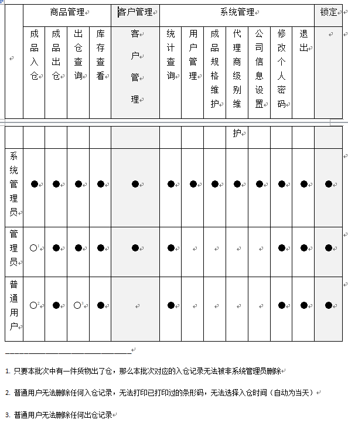

# 需求分析

## 公司情况

> 说明：入仓=入库，出仓=出库，供货单=送货单=供应单，规格=宽度，代理级别对应的单价=每平米价格

- **业务的基本流程：货物入仓 => 填写入仓记录(分配条码) => 打印条码 => 给每件货物粘贴条码 => 填写供货单 => 打印供货单 => 货物出仓**
- 入库是按批入的，每一批分配一个批号，批中的每一件货物分配一个条形码，用来粘贴在货物上标识货物
- 每次出货时填写一份送货单，每单一个送货单号
- 一物一码，正常情况下每个货物的条码只能打印一次，但也要考虑到磨损、打印错误的情况下可能需要重复打印
- 主要按代理级别定单价，虽然新建客户的时候设立了代理级别，但出货时选择了客户后可以不使用该客户新建时设置的代理级别对应的价格，依然可以通过修改代理级别来修改价格
- 送货单总价 = 代理级别对应的单价 * (货物1的规格 * 货物1的米数 + 货物2的规格 * 货物2的米数 + ....)

## 系统功能

### 主要功能

> 由公司情况初步整理出来的

1. 货物
    1. 入库
        1. 入库记录显示/添加/删除
        2. 货物条形码打印
    2. 出库
        1. 出库记录显示/添加/删除
        2. 供货单显示
    3. 查看
        1. 库存查看(剩余数量)
        2. 统计查询(入、出库数量)

2. 系统用户
    1. 用户显示/添加/检索/更新
    2. 软件锁定

### 辅助功能

> 为实现主要功能添加的功能

1. 货物规格
    货物规格显示/添加/删除

2. 公司信息(打印供货单时显示)
    显示/更新

3. 客户 Customer
    客户显示/查询/添加/更新/删除

4. 代理级别 AgentNorm
    代理级别显示/添加/更新

## 系统界面设计

菜单栏设置：

- 商品管理：成品入仓、成品出仓、出仓查询、库存查看

- 客户管理：客户管理

- 系统管理：统计查询、用户管理、成品规格维护、代理商级别维护、公司信息设置、修改个人密码、退出

- 锁定

其他设置：

1. 添加状态栏显示当前用户和登录时间
2. 为绝大多数的添加功能设置相关的内容输入以及“添加”按钮，查询功能可共用输入框，添加一个“查询”按钮
3. 把绝大多数的查看详情和删除功能设置到 dataGridView 中对应的记录后面，查看详情的使用弹窗操作，删除的弹窗确认

## 系统约定

1. 为系统用户划分权限，不同权限可使用功能不同

    

2. 入仓批号、条形码、供货单号的生成规则

    - 入仓批号：P-1000-190708-123 `P-规格( * 1000)-yyMMdd-流水号`

    - 条码：1000-190708-2-3-25 `规格( * 1000)-yyMMdd-机器-卷数(又叫大卷)-流水号`

    - 送货单号：201907-0007 `yyyyMM-流水号`

        每日入库批次(同规格)数最大为 999 批

        每日入库货物(同规格、机器、大卷)数最大为 99 件

        每月送货单数最大为 9999 张

3. 同一批货物只要其中一个货物出仓后，就不可以删除该入仓批号（系统管理员可以）

4. 规格被使用后不能删除该规格

5. 客户被使用后不能删除该客户

6. 代理级别被使用后不能删除该代理级别

7. 管理员和普通用户因为没有“用户管理”，“成品规格维护”，“代理商级别维护”，“公司信息设置”功能，但是这些信息在入仓记录或出仓记录中以选择的方式等所必须，所以系统首次使用时需要设置到以上信息，在需要添加新信息时也需要系统管理员来操作

8. 普通用户不具有任何删除的权限

## 数据设计

> 未使用外键的原因大概是不需要在数据库中设置删除外键关联数据时的操作

#### Agent 客户
ID          int             自增

Name        varchar(50)     主键  公司名

Contact     varchar(50)     可空  联系人

Phone       varchar(50)     可空  手机

Address     varchar(200)    可空  地址

LevelName   varchar(50)     可空  代理级别

Tel         varchar(50)     可空  固定电话

Fox         varchar(50)     可空  传真

#### Argument 参数(用来保存公司信息)
ArgName     varchar(50)           包括四个参数：Name, Phone, Address, GoodsName

ArgValue    varchar(50)     可空  参数值

#### InW 入仓记录
ID          int             自增

Batch       varchar(50)     主键  货物批号

NormName    varchar(50)     可空  货物规格

Barcode     varchar(100)    可空  本批货物第一个条码~最后一个条码

CreateTime  datetime        可空  数据库内的记录生成时间(自动)

Operator    varchar(50)     可空  入仓记录人员

Cnt         int             可空  本批货物总件数

InTime      datetime        可空  货物入仓时间

BigCnt      int             可空  货物入仓大卷

Machine     int             可空  货物入仓机器

Length      int             可空  货物入仓米数

Model       varchar(50)     可空  货物型号

#### InWDetail 入仓记录详情
Batch       varchar(50)     可空  货物批号

Barcode     varchar(50)     可空  货物条码

NormName    varchar(50)     可空  货物规格

Cnt         int             可空  货物件数

CreateTime  datetime        可空  数据库内的记录生成时间(自动)

PrintCnt    int             可空  货物条码打印次数

Length      int             可空  货物入仓米数

Model       varchar(50)     可空  货物型号

#### Level 代理级别
LevelID     int             自增

LevelName   varchar(50)     主键  代理级别名称

Price       money           可空  代理级别对应的价格

#### LevelPrice `(没用)`
ID          int             自增

LevelName   varchar(50)

ApplyDate   datetime

Price       money           可空

Operator    varchar(50)     可空

OperatorTime    datetime    可空

#### Norm 规格
NormID      int             主键

NormName    varchar(50)     可空  规格

#### Supply 供应单
ID          int             自增

SupplyID    varchar(50)     主键  供应单单号

AgentName   varchar(50)           客户名

Price       money                 单价

SumPrice    money                 总价(每一件货物的总价相加)

Operator    varchar(50)           记录填写人员

CreateTime  datetime              数据库内的记录生成时间(自动)

#### SupplyDetail 供应单详情
SupplyID    varchar(50)           供应单单号

Barcode     varchar(50)           条码

NormName    varchar(50)     可空  货物规格

Price       money           可空  单价

SumMoney    money           可空  总价(单价*米数)

Cnt         int             可空  件数

CreateTime  datetime        可空  数据库内的记录生成时间(自动)

Length      int             可空  货物米数

Model       varchar(50)     可空  货物型号

#### User 系统用户
UserID      int             自增

UserName    varchar(50)     主键  用户名

UserPwd     varchar(50)     可空  用户密码(默认密码：123456)

Position    varchar(50)     可空  身份权限

## 代码实现

> 说明：`=>` 表示界面之间的引用

#### 项目 WareHouse

- `Program.cs` (Main() 函数中的 `Application.Run(new frmLogin())` 得知启动程序时显示的是 `frmLogin` 窗口)
- `frmLogin.cs` (保存用户名等信息到 Global 类中) => `frmIndex.cs` (主界面，其他窗体在本窗体中显示，MDI技术) => `frmWarehouseView` (库存查看，按批号) => `frmViewDetail.cs` (库存详情，看条码)
- `frmUser.cs` (系统用户) => `frmUserUpdate.cs` (系统用户身份更改，恢复默认密码)
- `frmUpdatePwd.cs` (系统用户修改个人密码)
- `frmLock.cs` (锁定本软件)
- `frmGoodsIn.cs` (入仓相关) => `frmInDetail.cs` (货物详情)
- `frmGoodsOut.cs` (出仓相关) => `frmBatchUpload.cs` (批量上传条码的窗体)/`frmSupplyReport.cs` (打印出货单，数据报表技术) => `Supply.rdlc` (数据报表模板) => `DataSet1.xsd` (数据报表部分数据来源)
- `frmGoodsSearch.cs` (出仓查询，即供货单查询)
- `frmStatistics.cs` (统计查询，即按型号、规格显示入，出仓数量)
- `frmCompany.cs` (软件使用公司信息，显示在送货单上)
- `frmCustomer.cs` (顾客相关) => `frmCustomerUpdate` (顾客信息更新)
- `frmAgentNorm.cs` (顾客代理级别相关，不同级别不同单价) => `frmAgentNormUpdate.cs` (代理级别信息更新)
- `frmGoodsNorm.cs` (货物规格相关，货物规格对该司很重要) => `frmGoodsNormUpdate.cs` (货物规格信息更新)
- 0引用的窗体（即 `没用的`）：
    `frmSupplyDetail.cs` => `frmOutDetail.cs` (大概是 `frmSupplyReport` 报表窗体的遗留代替产物)
    `frmStartScan.cs` (大概是 `frmGoodsOut` 窗体的“即时扫描”功能的未实现产物)

##### 文件夹 Service（Model 层）
Agent.cs

InW.cs

InWDetail.cs

Level.cs

Norm.cs

Supply.cs

SupplyDetail.cs

SupplyRPT.cs

User.cs

OutW.cs `无用`

##### 文件夹 Properties
`SupplyRPT.datasource` (作为 `frmSupplyReport.cs` 中控件 SupplyPRTBindingSource 的数据源，使用了第15点的方法添加了一个以 SupplyRPT 为对象的的数据源)

#### 项目 Common 
- `BarcodeService.cs` (条形码打印设置)

- `CommonService.cs` (常用函数)

    其中被使用的有 `GetParamValue()`, `SetParamName() (对表 Argument 操作)`, `GetServerTime()`, `MoneyToChinese() (供货单使用)`

- `DataGridViewService.cs` (设置 dataGridView 的格式)

- `Global.cs` (用来存储软件运行期间使用的常量)

- `INIService.cs` (初始化内容，例如读取软件上次登录成功的登录名)

- `MyLog.cs` (用来保存日志)

- `ValidateService.cs` (验证生活常见字符串)

#### 项目 SqlServer
- `SqlHelper.cs` (数据操作通用类，命名空间为 SQLServer) => `SqlProvider.cs` (针对 SQL Server 的数据操作类)
- `DBService.cs` 备份数据库
- `DbHelperSQL.cs`  (与 `SqlHelper.cs` 功能相同，但本程序多数使用这个类的函数（该类的命名空间为 SQLServerDAL），而不是前者(怀疑重复))

#### Q&A

1. `frmGoodsOut` 的“即时扫描”是即时查数据库还是查 Model，如果是后者什么时候查的数据库

  答：IList<InW> allOut 用来保存条码记录对应的 InW 对象，在输入条码的时候(txt_Barcode_TextChanged() 和 link_Upload_Click()函数)新建一个以该条码为特征的 IW 对象，判断该对象是否重复 `foreach i in allOut` 或已出仓(判断 Model 的某个数据成员)，如果没有的话则添加到 allOut 中

2. `frmGoodsOut` 选择了级别和客户之后 dataGridView 的数据自动更新是怎么实现的

  答：dataGridView 绑定的是 AllOut 列表，选择了级别和客户后，AllOut 列表中 InW 对象的数据成员单价和总价改变，所以 dataGricView 的显示数据也跟着改变

3. `frmCustomer` 的查询功能是不是只有以客户名称为条件

  答：是的

4. `frmWareHouse` 的 dataGridView 的“详情”是什么时候查询的？

  答：点击之后生成了 frmViewDetial 对象，对象的加载事件使用 SQL 语句现查的

5. `frmWareHouse` 的“总计”行是怎么实现的？

  答：为 dataGridView 的数据来源 dataTable 添加一个 DataRow，设置该行的格式即可；颜色是在 cellFormatting 事件中实现

6. `frmGoodsSearch` 在不指定任何特定条件的情况下如何实现查询所有数据的

  答：先判断条件有没有被选择，选择了的话就向查询 SQL 语句的条件部分添加条件，注意这里的 SQL 的设置很巧妙，每个条件都以 “AND” 结尾，这样方便了条件的串联，无需考虑顺序，到最后如果包含了条件的话就将最后的“AND”删除

7. `frmViewDetail` 的条码怎么查询的

  答：在窗体的 Load 事件中使用 sql 语句查询